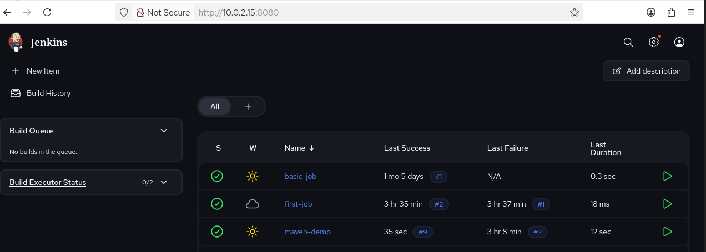
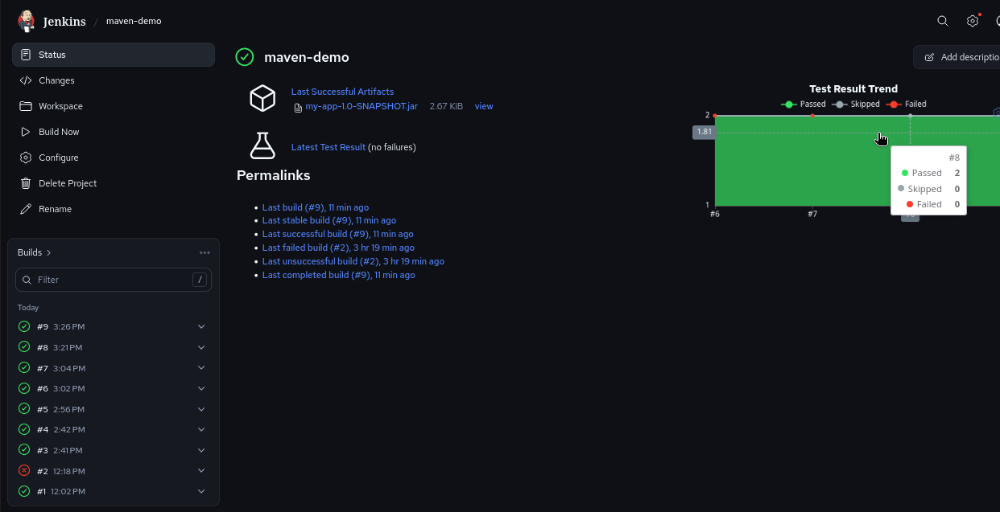
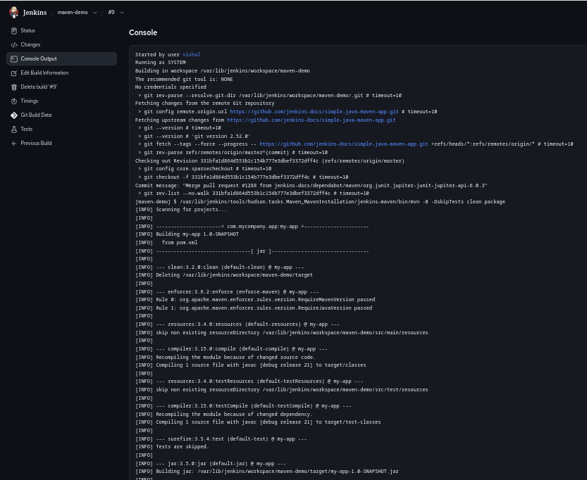

# simple-java-maven-app

This repository is for the
[Build a Java app with Maven](https://jenkins.io/doc/tutorials/build-a-java-app-with-maven/)
tutorial in the [Jenkins User Documentation](https://jenkins.io/doc/).

The repository contains a simple Java application which outputs the string
"Hello world!" and is accompanied by a couple of unit tests to check that the
main application works as expected. The results of these tests are saved to a
JUnit XML report.

The `jenkins` directory contains an example of the `Jenkinsfile` (i.e. Pipeline)
you'll be creating yourself during the tutorial and the `jenkins/scripts` subdirectory
contains a shell script with commands that are executed when Jenkins processes
the "Deliver" stage of your Pipeline.

# 🚀 Maven Jenkins CI/CD Project

This project demonstrates a complete CI/CD pipeline using:

- Java (Maven)
- Jenkins
- GitHub
- Linux (CentOS)

---

## 🔄 CI/CD Flow

GitHub → Jenkins → Maven Build → Deploy

---

## 📸 Screenshots

### 🔹 Jenkins Dashboard

### 🔹 GitHub Repository

### 🔹 Build Success

### 🔹 Console Output

---

## ⚙️ Tech Stack

- Java
- Maven
- Jenkins
- GitHub
- Linux (CentOS)

---

## 👨‍💻 Author

**Vishal Ranga**
