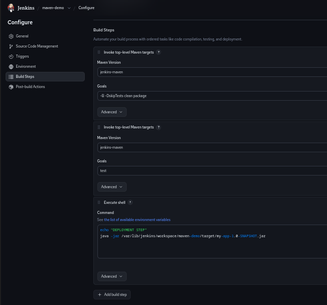
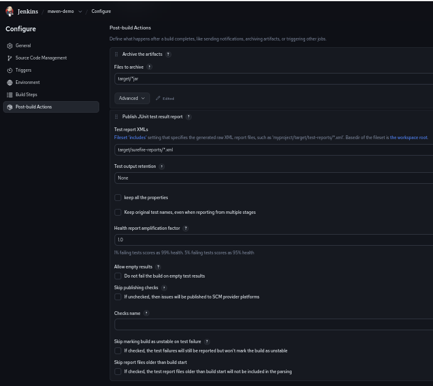
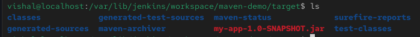

# 🚀 Maven Jenkins CI/CD Project

This project demonstrates a complete **CI/CD pipeline** using Jenkins integrated with a Maven-based Java application.

---

## 🔄 CI/CD Flow

GitHub → Jenkins → Maven Build → Test → Deploy

---

## ⚙️ Jenkins Configuration

### 🔹 Build Steps (Maven)



### 🔹 Post Build Actions



---

## 📸 Project Screenshots

### 🔹 Jenkins Dashboard


### 🔹 Build Success


### 🔹 Console Output


### 🔹 File Location



---

## 🛠️ Tech Stack

* Java
* Maven
* Jenkins
* GitHub
* Linux (CentOS)

---

## ✨ Features

* Automated build using Maven
* Continuous Integration using Jenkins
* Test execution and reporting
* Artifact generation (.jar file)
* Deployment using shell script

---

## 📦 Build Commands Used

```bash
mvn clean package
mvn test
```

---

## 🚀 Deployment Command

```bash
java -jar target/my-app-1.0-SNAPSHOT.jar
```

---

## 👨‍💻 Author

**Vishal Ranga**

* MCA Student | Cloud & DevOps Enthusiast
* Skills: AWS, Linux, IAM, Terraform, Docker

---

## 📌 Project Highlights

* Implemented a real-world CI/CD pipeline
* Integrated GitHub with Jenkins
* Automated build, test, and deployment process
* Hands-on experience with DevOps tools

---

## ⭐ Future Improvements

* Add Docker containerization
* Deploy application on AWS
* Convert to Jenkins Pipeline (Jenkinsfile)
* Add monitoring (Prometheus + Grafana)

---
